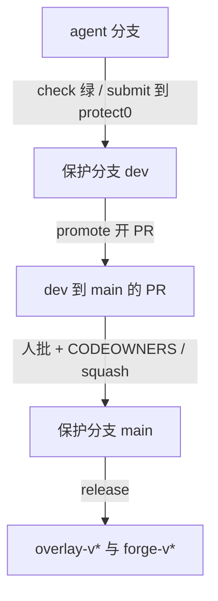

# 开发到 main 的路径

A 路线：agent 提交到 `dev`，人把 `dev` promote 到 `main`，再打产品 tag。Forge 永不 merge。

## ASCII

```text
agent 分支 (cursor/… copilot/ agent/)
        |
        |  forge check 绿
        |  forge submit --repo O/N          默认 base = protect[0] = dev
        |  需要 FORGE_SUBMIT_TOKEN
        v
     保护分支 dev
        |  CI required checks 绿
        |  approvals: 0（无人批）
        |
        |  人 / ops 在非 agent 分支：forge promote --repo O/N --from dev --to main
        |  agent 分支前缀上 live promote 拒绝；--dry-run 可以
        |  需要 FORGE_SUBMIT_TOKEN；开或更新 PR；永不 merge
        v
     保护分支 main 上的 promote PR
        |  CI required checks 绿
        |  approvals: 1 + CODEOWNERS
        |  人 squash 封顶，再换底
        v
     保护分支 main
        |
        |  python -m forge release --products overlay|forge
        v
     overlay-v* / forge-v*  annotated tag + GitHub Release
```

## mermaid


```mermaid
flowchart TD
  agent["agent 分支"] -->|check 绿 / submit 到 protect0| dev["保护分支 dev"]
  dev -->|"promote 开 PR"| pr["dev 到 main 的 PR"]
  pr -->|"人批 + CODEOWNERS / squash"| main["保护分支 main"]
  main -->|release| tags["overlay-v* 与 forge-v*"]
```

## 人与 agent 可 / 不可

| 动作 | Agent | 人 / Ops |
|---|---|---|
| `forge check` | 可以 | — |
| `forge submit` 到 `dev` | 可以（持 `FORGE_SUBMIT_TOKEN`） | — |
| `forge promote --dry-run` | 可以（人要求时；仍要 token） | 可以 |
| `forge promote` 开 PR（live） | **不可**（`cursor/` `copilot/` `agent/` 拒绝） | 可以（人 / ops 分支） |
| merge / squash | **不可** | 可以（合入锁绿 + 批） |
| live `forge apply` | **不可** | Ops |
| 把套件标 `blocked`，或清掉已有 `blocked` | **不可**（`suite_guard` 红；`review` 在 agent 枝也拒绝） | 可以 |
| `forge release` / 打 tag | **不可**（除非 Ops 明确要求 dry-run） | Ops |
| 写 `docs/STATE.md` | 可以（`forge status --write`） | 可以 |
| 改 `.github/workflows/` 里 `deny_paths` 命中的文件 | 本地 check 红 | 人改 |

进 `main` 默认 squash：**封顶**再压，压完**换底**。`submit` base 必须在 `protect`。**通用检查 ≠ 产品门。**
